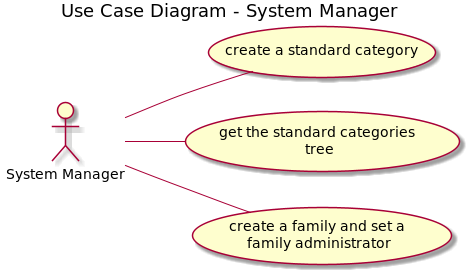
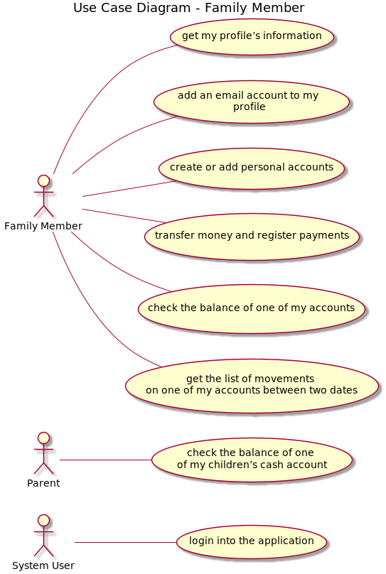

## Contents
- [Architecture Background](#architecture-background)
	- [Problem Background](#problem-background)
		- [System Overview](#system-overview)
		- [Context](#context)
		- [Driving Requirements](#driving-requirements)
			- [Functional requirements](#functional-requirements)
			- [Quality attributes](#quality-attributes)
				- [Funcionalidade](#funcionalidade)
				- [Usabilidade](#usabilidade)
				- [Confiabilidade (Reliability)](#confiabilidade-reliability)
				- [Desempenho (Performance)](#desempenho-performance)
				- [Suportabilidade](#suportabilidade)
				- [Design constraints](#design-constraints)
				- [Implementation constraints](#implementation-constraints)
				- [Interface constraints](#interface-constraints)
				- [Physical constraints](#physical-constraints)
	- [Solution Background](#solution-background)
		- [Architectural Approaches](#architectural-approaches)
		- [Analysis Results](#analysis-results)
		- [Mapping Requirements to Architecture](#mapping-requirements-to-architecture)

# Architecture Background
>Architecture Background provides information about the software architecture, by:
>- describing the background and rationale for the software architecture;
>- explaining the constraints and influences that led to the current architecture;
>- describing the major architectural approaches that have been utilized in the architecture.

## Problem Background
>The sub-parts of this section explain the constraints that provided the significant influence over the architecture.

### System Overview
> This section describes the general function and purpose for the system or subsystem whose architecture is described in this SAD.

*SWitCH Soft (SWS) develop an application to support family finance management. This is an important issue, as there are many families who have financial problems due to mismanagement and lack of control over their income and expenses.*

### Context
> This section describes the goals and major contextual factors for the software architecture. The section includes a description of the role software architecture plays in the life cycle, the relationship to system engineering results and artifacts, and any other relevant factors.

*The solution designed by SWS aims to take advantage of the possibilities of integration with financial entities and other relevant entities (utilities, supermarket chains, etc.). SWS believes that integration will increase the adoption and use of the software, as the tedious and error prone manual input of data is the main reason the users of other solutions present to justify abandoning them. To promote its solution, especially to the big players that it wants to integrate with, SWS aims to develop a “life like” demo of the system.*

NB: Contudo, o sistema aqui pedido é uma simplificação daquilo que é um sistema de gestão de finanças familiares, pelo que são assumidas simplificações para tornar o projeto exequível neste âmbito pedagógico.

Nesta edição do SWitCH; teremos a colaboração de product owners de diversas empresas da Porto Tech Hub que desenvolvem sistemas informáticos que abordam problemáticas semelhantes à tratada neste projecto.

### Driving Requirements
> This section lists the functional requirements, quality attributes and design constraints. It may point to a separate requirements document.

#### Functional requirements
1. US001 As a system manager, I want to create a standard category.
2. US002 As a system manager, I want to get the standard categories tree.
3. US003 As a system manager, I want that the list of standard categories to include those loaded (whenever needed) from a complementary system defined by configuration.
4. US010 As a system manager, I want to create a family and set the family administrator.
5 US080 As a system user, I want to login into the application in order to use it.
6. US101 As a family administrator, I want to add family members.
7. US104 As a family administrator, I want to get the list of family members and their relations.
8. US105 As a family administrator, I want to create a relation between two family members.
9. US106 As a family administrator, I want to change the relation between two family members.
10. US110 As a family administrator, I want to get the list of the categories on the family’s category tree.
11. ~~US111 As a family administrator, I want to add a category to the family’s category tree.~~
11. US111v2 As a family administrator, I want to add a custom category to the family’s category tree "extended" from either external or internal standard categories.
12. US120 As a family administrator, I want to create a family cash account.
13. US130 As a family administrator, I want to transfer money from the family’s cash account to another family member’s cash account.
14. US135 As a family administrator, I want to check the balance of the family’s 74 cash account or of a given family member.
15. US150 As a family member, I want to get my profile’s information.
16. US151 As a family member, I want to add an email account to my profile.
17. US170 As a family member, I want to create a personal cash account.
18. US171 As a family member, I want to add a bank account I have.
19. US172 As a family member, I want to add a bank savings account I have.
20. US173 As a family member, I want to add a credit card account I have.
21. US180 As a family member, I want to transfer money from my cash account to another family member’s cash account.
22. US181 As a family member, I want to register a payment that I have made using one of my cash accounts.
23. US185 As a family member, I want to check the balance of one of my accounts.
24. US186 As a family member, I want to get the list of movements on one of my accounts between to dates.
25. US188 As a parent, I want to check the balance of one of my children’s cash account.

___

___

___

#### Quality attributes
Os atributos de qualidade são categorizados e sistematizados segundo o modelo [FURPS+](https://en.wikipedia.org/wiki/FURPS).

##### Funcionalidade
n/a

##### Usabilidade
n/a

##### Confiabilidade (Reliability)
n/a

##### Desempenho (Performance)
n/a

##### Suportabilidade
n/a

##### Design constraints
1. O sistema deve ser composto por uma aplicação web do tipo Single Page Application (SPA) que permite aos utilizadores autorizados aceder às diferentes funcionalidades da aplicação.

2.  Embora não esteja no âmbito atual do projeto, no futuro deve ser levada em conta a interação com APIs externas (instituições financeiras, serviços púbicos, entre outros).

3. A aplicação deve utilizar DDD e Onion Architecture.

4. A aplicação deve ser RESTful.

5. A aplicação deve ter arquitectura Client-Server.

##### Implementation constraints
6. As linguagens de programação a ser utilizadas são o Javascript (na framework React) para front end e Java para back end.

7. No back end, as frameworks a ser utilizadas são o Spring Boot e o JPA Hibernate. 

##### Interface constraints
8. Segundo a us003 a nossa aplicação deve consumir dados externos relativos às *Standard Categories* de um ou outro sistema selecionado através de ficheiro de configuração. Da mesma forma, a aplicação deve fornecer um API que disponibiliza esses mesmos dados a outro sistema.

##### Physical constraints
9. Há servidores virtuais do ISEP onde deverão estar alojadas a aplicação, base de dados e front end.

## Solution Background
> The sub-parts of this section provide a description of why the architecture is the way that it is, and a convincing argument that the architecture is the right one to satisfy the behavioral and quality attribute goals levied upon it.

### Architectural Approaches
> This section provides a rationale for the major design decisions embodied by the software architecture. It describes any design approaches applied to the software architecture, including the use of architectural styles or design patterns, when the scope of those approaches transcends any single architectural view. The section also provides a rationale for the selection of those approaches. It also describes any significant alternatives that were seriously considered and why they were ultimately rejected. The section describes any relevant COTS issues, including any associated trade studies.

Baseado nos requisitos não funcionais e restrições de design, serão adotadas as seguintes abordagens/padrões/estilos:

- Client-Server;
- Web Application, em que o frontend é desempenhado por uma SPA (Single Page Application);
- Serão adotados os nível 1, 2 e 3 do [Modelo de Maturidade de Richardson](https://martinfowler.com/articles/richardsonMaturityModel.html) aplicado a REST;
- Layered architecture, mais especificamente Onion Architecture, por razões académicas.

### Analysis Results
> This section describes the results of any quantitative or qualitative analyses that have been performed that provide evidence that the software architecture is fit for purpose. If an Architecture Tradeoff Analysis Method evaluation has been performed, it is included in the analysis sections of its final report. This section refers to the results of any other relevant trade studies, quantitative modeling, or other analysis results.

Não existem por agora resultados de análise ou avaliação.

### Mapping Requirements to Architecture
> This section describes the requirements (original or derived) addressed by the software architecture, with a short statement about where in the architecture each requirement is addressed.

TBD