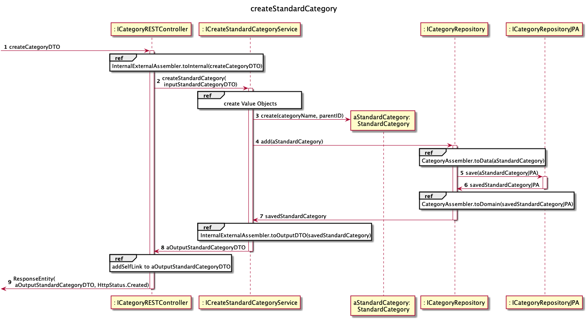
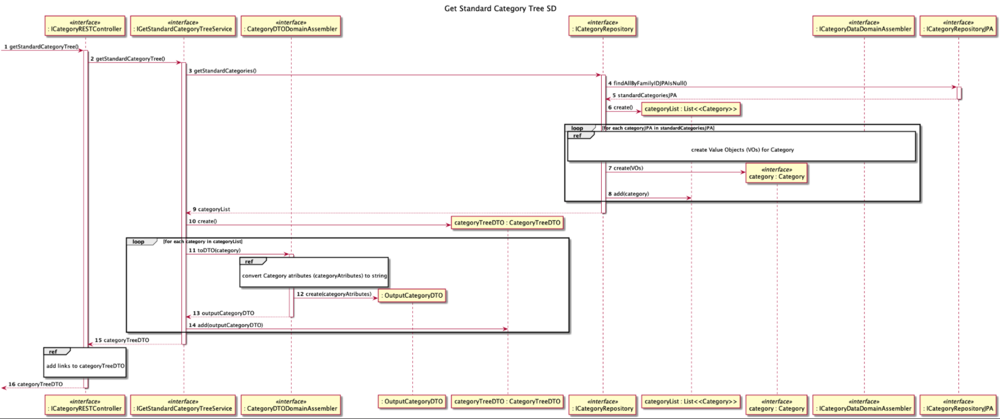
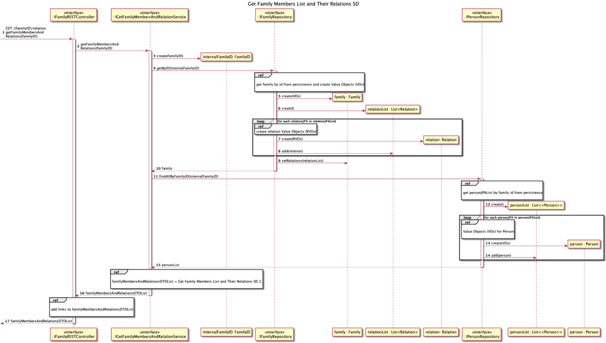
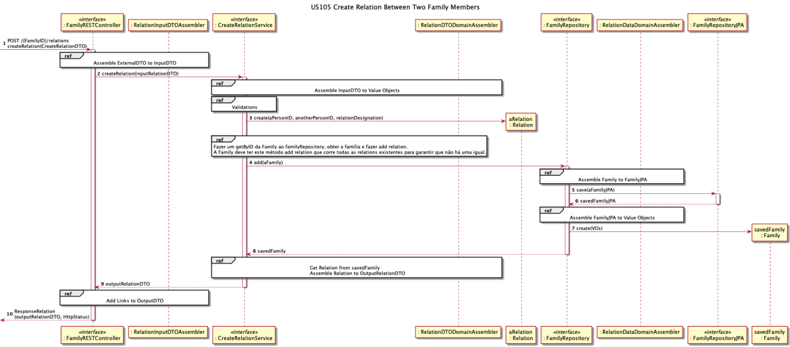
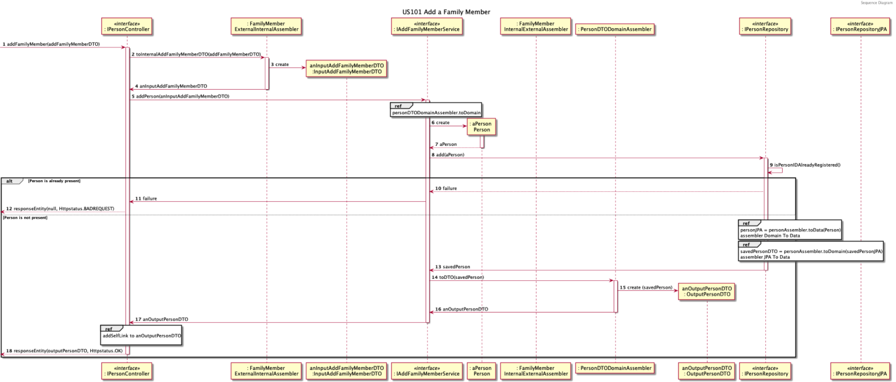
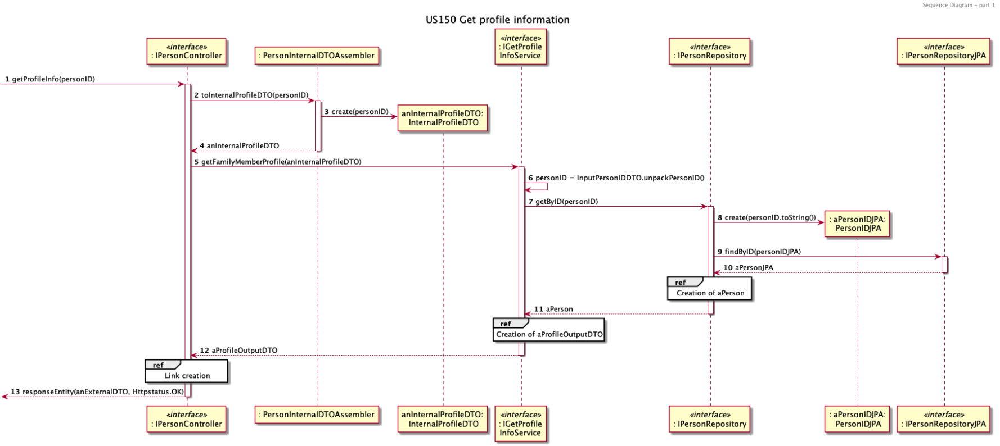
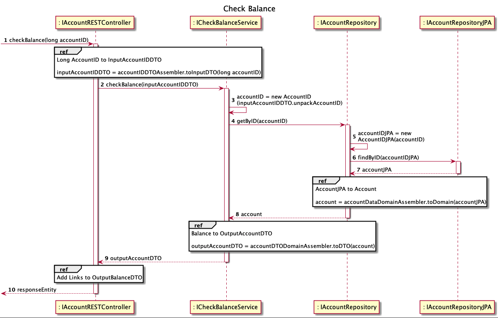

	## Contents
- [Views](#views)
	- [Introduction](#introduction)
	- [Nível 1](#nível-1)
		- [Vista Lógica](#vista-lógica)

  

- [Vista de Processos](#vista-de-processos)
  - [SSD US010](#ssd-us1)
	

  - [SSD US101](#ssd-us2)
  - [SSD US104](#ssd-us3)
  - [SSD US105](#ssd-us4)
  - [SSD US150](#ssd-us5)
  - [SSD US003](#ssd-us5)
  - [SSD US111v2](#ssd-us5)
  - [SSD US108](#ssd-us5)
  - [(outros SSD arquiteturalmente relevantes)](#outros-ssd-arquiteturalmente-relevantes)
	- [Nível 2](#nível-2)
		- [Vista Lógica](#vista-lógica-1)
		- [Vista de Processos](#vista-de-processos-1)
			- [SSD US13 (Porquê esta US?)](#ssd-us13-porquê-esta-us)
			- [(outros SSD arquiteturalmente relevantes)](#outros-ssd-arquiteturalmente-relevantes-1)
		- [Vista de Implementação](#vista-de-implementação)
		- [Vista Física](#vista-física)
	- [Nível 3 (Front end)](#nível-3-ui)
		- [Vista Lógica](#vista-lógica-3)
		- [Vista de Processos](#vista-de-processos-3)
		- [Vista de Implementação](#vista-de-implementação-2)
		- [Vista Física](#vista-física-2)
	- [Nível 3 (Back end)](#nível-3-mdv)
		- [Vista Lógica](#vista-lógica-4)
		- [Vista de Processos](#vista-de-processos-4)
		- [Vista de Implementação](#vista-de-implementação-3)
		- [Vista Física](#vista-física-3)
	- [Nível 3 (Persistência)](#nível-3-planeamento)
		- [Vista Lógica](#vista-lógica-5)
		- [Vista de Processos](#vista-de-processos-5)
		- [Vista de Implementação](#vista-de-implementação-4)
		- [Vista Física](#vista-física-4)

# Views

## Introduction
Será adotada a combinação de dois modelos de representação arquitetural: C4 e 4+1.

O Modelo de Vistas 4+1 [[Krutchen-1995]](References.md#Kruchten-1995) propõe a descrição do sistema através de vistas complementares permitindo assim analisar separadamente os requisitos dos vários stakeholders do software, tais como utilizadores, administradores de sistemas, project managers, arquitetos e programadores. As vistas são deste modo definidas da seguinte forma:

- Vista lógica: relativa aos aspetos do software visando responder aos desafios do negócio;
- Vista de processos: relativa ao fluxo de processos ou interações no sistema;
- Vista de desenvolvimento: relativa à organização do software no seu ambiente de desenvolvimento;
- Vista física: relativa ao mapeamento dos vários componentes do software em hardware, i.e. onde é executado o software;
- Vista de cenários: relativa à associação de processos de negócio com atores capazes de os despoletar.

O Modelo C4 [[Brown-2020]](References.md#Brown-2020)[[C4-2020]](References.md#C4-2020) defende a descrição do software através de quatro níveis de abstração: sistema, contentor, componente e código. Cada nível adota uma granularidade mais fina que o nível que o antecede, dando assim acesso a mais detalhe de uma parte mais pequena do sistema. Estes níveis podem ser equiparáveis a mapas, e.g. a vista de sistema corresponde ao globo, a vista de contentor corresponde ao mapa de cada continente, a vista de componentes ao mapa de cada país e a vista de código ao mapa de estradas e bairros de cada cidade.
Diferentes níveis permitem contar histórias diferentes a audiências distintas.

Os níveis encontram-se definidos da seguinte forma:
- Nível 1: Descrição (enquadramento) do sistema como um todo;
- Nível 2: Descrição de contentores do sistema;
- Nível 3: Descrição de componentes dos contentores;
- Nível 4: Descrição do código ou partes mais pequenas dos componentes (e como tal, não será abordado neste DAS/SAD).

Pode-se dizer que estes dois modelos se expandem ao longo de eixos distintos, sendo que o Modelo C4 apresenta o sistema com diferentes níveis de detalhe e o Modelo de Vista 4+1 apresenta o sistema de diferentes perspetivas. Ao combinar os dois modelos torna-se possível representar o sistema de diversas perspetivas, cada uma com vários níveis de detalhe.

Para modelar/representar visualmente, tanto o que foi implementado como as ideias e alternativas consideradas, recorre-se à Unified Modeling Language (UML) [[UML-2020]](References.md#UML-2020) [[UMLDiagrams-2020]](References.md#UMLDiagrams-2020).

## Nível 1
### Vista Lógica


### Vista de Processos
#### SSD US1

```` puml

    autonumber
    title createStandardCategory SSD
    actor "System Manager" as systemManager
    participant "System" as system

    activate systemManager
    systemManager -> system: create a Standard Category
    activate system
    systemManager -> system: input required data
    system --> systemManager: inform success
    deactivate system

@endpuml
````


#### SSD US2


#### (outros SSD arquiteturalmente relevantes)
[...]

## Nível 2
### Vista Lógica


### Vista de Processos

#### SSD US13 (Porquê esta US?)
TBD

#### (outros SSD arquiteturalmente relevantes)
[...]

### Vista de Implementação


### Vista Física

Uma proposta muito simplificada.


De facto, deve-se ter em consideração os requisitos não funcionais ["Physical Contraints"](Background.md#Physical_Constraints).

## Nível 3 (MDR)
### Vista Lógica
Alternativa baseada numa arquitetura por camadas sobrepostas:


Alternativa baseada numa arquitetura por camadas concêntricas (Onion):


A alternativa Onion será a adotada.

### Vista de Processos

#### SD US01
TBD

#### (outros SSD arquiteturalmente relevantes)
[...]

### Vista de Implementação


Alguns detalhes mais (se existissem pais do que 4 níveis, podia ser considerado nível 4):


### Vista Física

Por agora, não existe necessidade de ser representada.

## Nível 3 (UI)

### Vista Lógica
TBD

### Vista de Processos
TBD

### Vista de Implementação
TBD

### Vista Física
TBD


## Nível 3 (Back-end)
### Vista Lógica

No desenvolvimento da aplicação foram aplicados vários padrões de design de software. 
Inicialmente a representação do modelo lógico seguiu a arquitetura **DDD**, domain-driven design, como forma introdutória para a reestruturação e nova aplicação do modelo de domínio.
Foram introduzidos conceitos como os *aggregates* e *value objects* que permitiram iniciar a reengenharia da aplicação e criar as bases para a utilização da arquitetura **Onion**.

DDD diagram

A forma final da aplicação utiliza a arquitetura **Onion** que é representada por uma divisão em camadas concêntricas cujas dependências têm um sentido interno.
O diagrama de classes apresenta-se dividido em 4 camadas, **infrastructure**, **interface adapters**, **use case services** e **domain**, sendo a infrastructure a mais exterior e a domain a mais interior, representado na seguinte imagem.

Class Diagram


### Vista de Processos

Seguindo a estruturação apresentada na vista lógica é possível construir a **sequência de processos que serão a base de funcionamento para a implementação das user stories**. 


Aplicando a estrutura do diagrama de sequência podemos concluir que segue um padrão comum para todas as **user stories** da aplicação.
Desta forma, há um pedido http direccionado ao **REST controller** que invoca um service, específico para cada caso de uso, onde a lógica de negócio será aplicada. Daqui será invocado o repositório do respetivo agregado envolvido, que será responsável pela comunicação com a persistência, e mediante o tipo de pedido adicionar ou obter a informação pretendida.

Entre cada uma destas etapas serão invocados **assemblers** cuja finalidade é mapear os dados com o objectivo de proteger e encapsular a informação proveniente de camadas diferentes. Isto permite-nos respeitar os princípios do encapsulamento e tornar a aplicação escalável.

Esta arquitetura garante que o **single responsibility principle** é respeitado.


**Lista de diagramas de sequência separados por agregados**:

#### 1) CATEGORY

#### US001 - Create Standard Category



#### US002 - Create Standard Category Tree



#### US110 - Get Category list


______

#### 2) FAMILY

#### US010 - Create Family and set Administrator


#### US104 - Get family member list and their relation



#### US105 - Create relation



______

#### 3) PERSON

#### US101 - Add family member



#### US150 - Get profile information



#### US151 - Add email


______

#### 4) Account 

Todas as Accounts seguem a mesma forma de criação variando apenas o OwnerID, familyID ou PersonID.
Para as Account de person, os diferentes tipos de Accounts são criadas com a selecção do respectivo AccountType, como se encontra presente no diagrama das Factory 1 e 2.

#### US120 - Create family Cash Account


#### US170,171,172,173 - Create Person's Cash, Bank, BankSavings and Credit Accounts


#### Account Factory 1 (sem accountID)


#### Account Factory 2 (com accountID)


#### US135,185,188 - Check balance (of any Account)




### Vista de Implementação


 

### Vista Física
TBD

## Nível 3 (Persistência)
### Vista Lógica

Para conseguir a persistência de dados na aplicação, foi utilizado um modelo em espelho dos objetos de domínio. 

Cada Objeto de Domínio que se pretende guardar em persistência tem um Objeto de Dados correspondente que utiliza a _programming interface_ Jakarta Persistence API (JPA). Esta simetria de Domínio/Dados é representada na imagem seguinte:


### Vista de Processos
Assim que os Objetos de Domínio forem convertidos para Objetos de Dados JPA (usando _Assemblers_ dedicados ao efeito em classes _Repository_ de domínio), serão adicionados à base de dados usando _interfaces_ de Repositórios CRUD adequados ao seu tipo.
O repositório CRUD irá adicionar a informação contida nos Objetos de Dados JPA à base de dados, devolvendo uma cópia do objeto idêntica ou, em alguns casos, com um ID gerado automaticamente aquando da adição. Esta sequencia de processos está representada na imagem seguinte, uma secção do SD da US120 - _Create Family Cash Account_:


### Vista de Implementação
A adição/recolha de informação à base de dados é da inteira responsabilidade dos RepositóriosJPA (_CRUD Repositories_). Os Objetos de Dados JPA apenas são manipulados por estes repositórios, sendo o único envolvimento por outras classes a sua tradução de/para domínio por parte dos DataDomainAssemblers.
Não há nenhum contacto com Objetos JPA e classes na camada de Serviço:


### Vista Física
A implementação da aplicação usa duas bases de dados diferentes: POSTGRES para produção e H2 para testes. Esta distinção é obtida através de dois ficheiros de propriedades distintos, que são indicados através duma tag _TestPropertySource_:

```java
@SpringBootApplication
@TestPropertySource(locations = "classpath:application-test.properties")
public class
FFMSpringBootApplication {...}
```

A base de dados POTSGRES está de momento alojada num servidor Amazon Web Service (AWS) 

```java
spring.jpa.database=POSTGRESQL
spring.datasource.platform=postgres
spring.datasource.url=jdbc:postgresql://ffmapp.c5zejpkmwdl8.eu-west-3.rds.amazonaws.com:5432/ffmapp
spring.datasource.username=g3
spring.datasource.password=*********
spring.jpa.show-sql=true
spring.jpa.generate-ddl=true
spring.jpa.hibernate.ddl-auto=update
spring.jpa.properties.hibernate.jdbc.lob.non_contextual_creation=true
```
